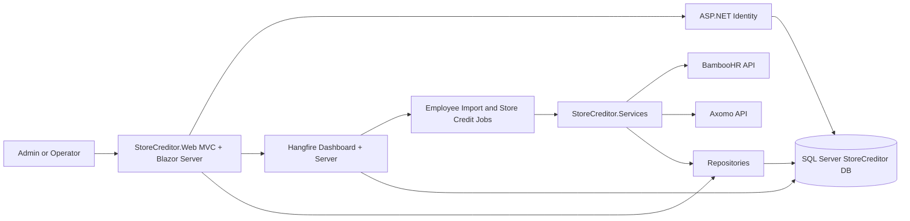

# StoreCreditor

StoreCreditor is an ASP.NET Core 10 MVC application that imports newly hired employees from BambooHR and issues a one-time `$50` new employee store credit through Axomo. It includes ASP.NET Identity authentication, SQL Server persistence, Hangfire background processing, typed HTTP clients, Polly retry policies, Blazor Server dashboard widgets, EF Core migrations, and a SQL creation script.

## Architecture



## Folder Structure

```text
StoreCreditor.sln
StoreCreditor.slnx
src/
  StoreCreditor.Web/       MVC UI, Identity, Hangfire, Blazor Server, startup
  StoreCreditor.Services/  Business services, jobs, API clients, validation, email
  StoreCreditor.Data/      EF Core DbContext, entities, migrations, repositories
tests/
  StoreCreditor.Tests/     Focused unit tests
sql/
  StoreCreditor_InitialCreate.sql
```

## Technology Stack

- .NET 10 / ASP.NET Core MVC
- Blazor Server
- ASP.NET Core Identity with email confirmation, email OTP two-factor, reset, lockout
- Entity Framework Core 10 with SQL Server
- Hangfire with SQL Server storage
- Polly retry policies for outbound HTTP
- Bootstrap 5 served locally from `wwwroot/lib`
- xUnit tests

## Database Schema

Application tables:

- `EmployeeStaging`: BambooHR employees awaiting or completing processing.
- `EmployeeCreditHistory`: every Axomo credit attempt, with a filtered unique index preventing duplicate successful new employee credits for the same employee/description.
- `AuditLog`: structured operational events for jobs, API calls, validation failures, auth-related events, and exceptions.

Identity tables and application tables are created by EF Core migrations. Hangfire SQL Server storage prepares the `HangFire` schema automatically on startup; the packaged script is also included under `sql/Hangfire_Install.sql` for explicit database provisioning.

## Background Jobs

- `employee-import`: daily by default, imports BambooHR directory employees not already staged.
- `store-credit`: every 15 minutes by default, validates staged employees, checks local credit history, checks Axomo credit logs, and issues the configured credit.

Both schedules are configurable in `appsettings.json` under `Hangfire`.

## Authentication Flow

Only `@aimpointdigital.com` email addresses can register or sign in. Registration requires email confirmation. Email OTP two-factor authentication is controlled by `Authentication:UseOtp`, password reset is supported, and lockout is configured after repeated failed attempts.

The first registered user receives the `Admin` role. Later users receive `Operator`. The Hangfire dashboard and configuration/job pages require `Admin`.

## Configuration

All settings are in `src/StoreCreditor.Web/appsettings.json` and can be overridden by user secrets or environment variables.

Important sections:

- `ConnectionStrings:DefaultConnection`
- `SMTP`
- `Hangfire`
- `MicrosoftEntraId`
- `Authentication`
- `BambooHR`
- `Axomo`
- `Credit`
- `FeatureFlags`
- `Logging`

For SMTP, keep `SMTP:AllowInvalidServerCertificate=false` in production. It is enabled in `appsettings.Development.json` to support local/internal SMTP servers with self-signed, untrusted, or hostname-mismatched certificates. The preferred production fix is to set `SMTP:Host` to the certificate's DNS name and trust the issuing CA certificate in Windows.

Feature flags:

- `PauseJobs`
- `EnableCreditIssuing`
- `EnableEmployeeImport`
- `DryRunMode`
- `StagingMode`
- `StagingEmployeeEmails`

When `StagingMode=true`, BambooHR import stages only employees whose `workEmail` appears in `FeatureFlags:StagingEmployeeEmails`, and the Axomo credit job processes only staged employees from that same list. If staging mode is enabled with no emails configured, both jobs skip work.

Authentication flags:

- `UseOtp`

## Running Locally

1. Configure SQL Server Express:

   ```text
   Server=localhost\SQLEXPRESS
   Authentication=Windows Authentication
   ```

2. Restore tools and packages:

   ```powershell
   dotnet tool restore
   dotnet restore StoreCreditor.sln
   ```

3. Configure keys in `src\StoreCreditor.Web\appsettings.json`:

   ```json
   {
     "MicrosoftEntraId": {
       "TenantId": "<tenant-id>",
       "ClientId": "<application-client-id>",
       "ClientSecret": "<client-secret>",
       "RedirectUri": "https://localhost:7252/signin-oidc",
       "PostLogoutRedirectUri": "https://localhost:7252/Identity/Account/Login"
     },
     "Authentication": {
       "UseOtp": true
     }
   }
   ```

4. Apply migrations:

   ```powershell
   dotnet tool run dotnet-ef database update --project src\StoreCreditor.Data --startup-project src\StoreCreditor.Web
   ```

5. Run the application:

   ```powershell
   dotnet run --project src\StoreCreditor.Web
   ```

## SQL Script

To create the EF-managed database objects manually, use:

```text
sql/StoreCreditor_InitialCreate.sql
```

To pre-create Hangfire objects instead of relying on automatic Hangfire schema preparation, run:

```text
sql/Hangfire_Install.sql
```

## BambooHR Integration

The typed `IBambooHrService` uses Basic Authentication and implements:

- company information
- employee directory via `GET /api/v1/employees/directory`
- employee lookup
- employee dependents

Responses are deserialized using `System.Text.Json` models.

## Axomo Integration

The typed `IAxomoService` supports API key or bearer token authentication and implements:

- get user
- get store credit balance
- get credit logs
- give credit via `POST /StoreCreditLog/GiveCredit`

## Retry Policy

Outbound BambooHR and Axomo HTTP clients use Polly with three exponential-backoff attempts. The retry policy handles transient network failures, HTTP 5xx, timeouts, and request timeout responses. Validation failures and normal 4xx responses are not retried by the business workflow.

## Deployment Notes

- Store secrets in environment variables, user secrets, Key Vault, or the deployment platform secret store.
- Run EF migrations during deployment or execute the generated SQL script.
- Ensure the Hangfire dashboard is protected behind HTTPS and authenticated admin access.
- Keep `DryRunMode=true` until BambooHR and Axomo credentials are verified.

## Troubleshooting

- Registration email not received: confirm `SMTP` settings. In development, the confirmation link is displayed on the registration confirmation page.
- SMTP certificate error: use the server hostname that matches the certificate, trust the issuing CA, or temporarily set `SMTP:AllowInvalidServerCertificate=true` for local development only.
- Jobs are not issuing credits: check `FeatureFlags`, Hangfire dashboard, and `AuditLog`.
- Duplicate employee credit prevented: inspect `EmployeeCreditHistory` and Axomo credit logs.
- SQL connection fails: verify SQL Server Express is running and `TrustServerCertificate=True` is acceptable for local development.

## Future Improvements

- Add richer Axomo contract tests against a sandbox.
- Add admin user invitation workflow.
- Add paging/filtering for queue and audit pages.
- Add health checks and OpenTelemetry traces.
